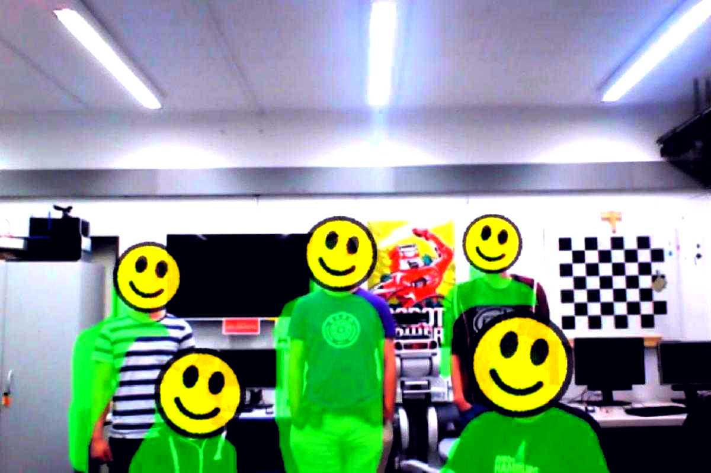

# Crossmodal person detection from depth and color

### Usage
- Start person detector: `roslaunch person_detection person_detection.launch`
- Enable person detector: `roslaunch person_detection enable.launch`

### Configuration
- See `person_detection.launch`

